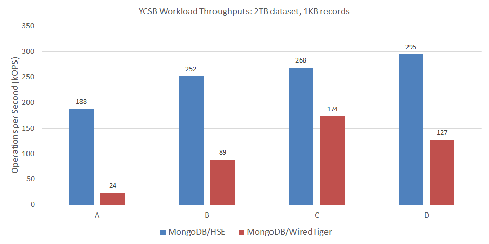

# MongoDB

MongoDB&reg; is a popular document-oriented NoSQL database.
The MongoDB implementation is open source, and includes an extensible
framework for integrating different storage engines.

We integrated HSE with MongoDB 3.4.17 to validate its benefits within a
real-world storage application.
The `hse-mongo` [repo](https://github.com/hse-project/hse-mongo) is a fork of
MongoDB that adds support for HSE.
MongoDB with HSE (MongoDB/HSE) demonstrates significantly increased
performance and scalability for many workloads when storing data on SSDs.

In the sections that follow, the reader is assumed to be familiar with
configuring and running MongoDB.
The information provided here is specific to using MongoDB with HSE.

## Install HSE and Create a KVDB

Review the getting started section of this documentation.
Then, following those instructions and examples, start by

* Installing HSE and mpool from packages or source
* Configuring an mpool for HSE storage with appropriate permissions
* Creating an HSE KVDB in that mpool to store the MongoDB data

In the `mongod.conf` example below, we assume the name of the mpool
is `mongoData`, which is also the name of the KVDB.


## Install MongoDB Dependencies

Install dependencies for your platform.

=== "RHEL 8"

    ```
    $ sudo dnf install python2-pip gcc-toolset-9 libuuid-devel lz4 lz4-devel openssl-devel openssl-devel numactl libpcap libpcap-devel golang-1.11.13 createrepo rpmdevtools
    $ sudo alternatives --set python /usr/bin/python2
    $ pip2 install --user scons
    ```

=== "Ubuntu 18.04"

    ```
    $ sudo apt-get install debhelper rpm golang libpcap-dev
    ```

=== "RHEL 7"

    ```
    $ sudo yum install devtoolset-9 rh-mongodb32-scons.noarch scl-utils libuuid-devel lz4 lz4-devel openssl-devel numactl libpcap libpcap-devel golang-1.9.4 python36 createrepo rpmdevtools
    ```


## Install MongoDB with HSE from Packages

MongoDB/HSE can be installed from release packages.

Download and install the latest `hse-mongo`
[packages](https://github.com/hse-project/hse-mongo/releases) for your platform.
Package names start with `hse-mongodb-*A.B.C.D.E-X.Y.Z`, where

* `A.B.C` is the MongoDB version (e.g., `3.4.17`)
* `D.E` is our MongoDB integration version
* `X.Y.Z` is the minimum HSE release version required

!!! tip
    An example of a specific prefix is hse-mongodb-server-3.4.17.2.1-1.8.0.

Install the packages for your platform as follows.

=== "RHEL 8"

    ```
    $ sudo dnf install ./hse-mongodb-server-A.B.C.D.E-X.Y.Z*.rpm
    $ sudo dnf install ./hse-mongodb-mongos-A.B.C.D.E-X.Y.Z*.rpm
    $ sudo dnf install ./hse-mongodb-shell-A.B.C.D.E-X.Y.Z*.rpm
    $ sudo dnf install ./hse-mongodb-tools-A.B.C.D.E-X.Y.Z*.rpm
    ```

=== "Ubuntu 18.04"

    ```
    $ sudo apt-get install ./hse-mongodb-server_A.B.C.D.E-X.Y.Z*.deb
    $ sudo apt-get install ./hse-mongodb-mongos_A.B.C.D.E-X.Y.Z*.deb
    $ sudo apt-get install ./hse-mongodb-shell_A.B.C.D.E-X.Y.Z*.deb
    $ sudo apt-get install ./hse-mongodb-tools_A.B.C.D.E-X.Y.Z*.deb
    ```

=== "RHEL 7"

    ```
    $ sudo yum install ./hse-mongodb-server-A.B.C.D.E-X.Y.Z*.rpm
    $ sudo yum install ./hse-mongodb-mongos-A.B.C.D.E-X.Y.Z*.rpm
    $ sudo yum install ./hse-mongodb-shell-A.B.C.D.E-X.Y.Z*.rpm
    $ sudo yum install ./hse-mongodb-tools-A.B.C.D.E-X.Y.Z*.rpm
    ```


## Install MongoDB with HSE from Source

MongoDB/HSE can also be built and installed from source.

Clone the latest release tag from the `hse-mongo`
[repo](https://github.com/hse-project/hse-mongo/releases).
Releases are named `rA.B.C.D.E-hse-X.Y.Z` where

* `A.B.C` is the MongoDB version (e.g., `3.4.17`)
* `D.E` is our MongoDB integration version
* `X.Y.Z` is the minimum HSE release version required

!!! tip
    An example of a specific release tag is r3.4.17.2.1-hse-1.8.0.

For example

    $ git clone https://github.com/hse-project/hse-mongo.git
    $ cd hse-mongo
    $ git checkout rA.B.C.D.E-hse-X.Y.Z

Build and install MongoDB/HSE for your platform as follows.

!!! note
    For `r3.4.17.2.0-hse-1.7.1` see the build instructions in the
    [release notes](../help/relnotes.md#mongodb-release-notes).

=== "RHEL 8"

    ```
    $ hse-packaging/build.py --clean
    ```
    Install the resulting packages as described above for the RHEL 8 release
    packages.  The build displays the package location by executing
    ```
    $ find /tmp/$(id -un)/pkgbuild/repo/ -name hse-mongo*.rpm
    ```

=== "Ubuntu 18.04"

    ```
    $ hse-packaging/build.py --clean
    ```
    Install the resulting packages as described above for the Ubuntu 18.04
    release packages.  The build displays the package location by executing
    ```
    $ find /tmp/$(id -un)/pkgbuild/repo/ -name hse-mongo*.deb
    ```

=== "RHEL 7"

    ```
    $ hse-packaging/build.py --clean
    ```
    Install the resulting packages as described above for the RHEL 7 release
    packages.  The build displays the package location by executing
    ```
    $ find /tmp/$(id -un)/pkgbuild/repo/ -name hse-mongo*.rpm
    ```


## New MongoDB Options

MongoDB with HSE adds the following command-line options to
`mongod`, which are reflected in `mongod --help`.

* `--hseMpoolName` is the name of the mpool (KVDB) storing the MongoDB data; default is `mp1`
* `--hseParams` is a string of semi-colon separated HSE parameters; e.g., `"kvdb.dur_intvl_ms=1000;kvdb.log_lvl=6"`
* `--hseConfigPath` is the path to an HSE configuration file
* `--hseCollectionCompression` is the compression algorithm applied (`lz4` or `none`); default is `lz4`
* `--hseCollectionCompressionMinBytes` is the min document size (bytes) to compress; default is `0`

These same HSE options are also supported in `mongod.conf`, in addition
to the standard storage configuration options.

    # Standard options
    storage:
      dbPath: /var/lib/mongo
      journal:
        enabled: true
        commitIntervalMs: 100

    # Use Heterogeneous-memory Storage Engine (HSE). This is the default.
    # Specify the mpool (KVDB) for storing data. Default is "mp1".
      engine: hse
      hse:
        mpoolName: mongoData

    # Uncomment to disable or customize compression for HSE.
    # Allowable compression types are "lz4" or "none". Default is "lz4".
    #    collectionCompression: none
    #    collectionCompressionMinBytes: 0

    # Uncomment and edit to use an HSE configuration file.
    #    configPath: <path to HSE config file>

    # HSE parameters for tuning, support, or debug
    #    params:

    # Recommended oplog size for HSE when using replica sets.
    replication:
      oplogSizeMB: 32000
      replSetName: rs1

    # Recommended query and other parameters for HSE
    setParameter:
      internalQueryExecYieldIterations: 100000
      internalQueryExecYieldPeriodMS: 1000
      replWriterThreadCount: 64

Options specified in `hse.params` or `--hseParams` take precedence over those
specified in an HSE configuration file specified via
`hse.configPath` or `--hseConfigPath`.

!!! note
    Use the MongoDB `hse.collectionCompression` or `--hseCollectionCompression`
    option to specify value compression, **not** the native
    HSE `kvs.value_compression` parameter.


## Run MongoDB with HSE

Start and manage `mongod` as you would normally.
The owner (UID) and group owner (GID) of the mpool that `mongod` will use
to store data should match the user account running `mongod`.
If `mongod` was installed from packages, which is normally the case,
you should use the `mongod` user account.

See the [release notes](../help/relnotes.md#mongodb-release-notes) for any
limitations or known issues for a particular release of MongoDB/HSE.


## YCSB Performance Results

Below are results from running YCSB with MongoDB/HSE.
For comparison, we include results from running YCSB with MongoDB 4.2.4
using the default WiredTiger storage engine (MongoDB/WiredTiger).

!!! info
    MongoDB 4.2.4 was the latest version available at the time we conducted
    this performance study, which is why we selected it for comparison.
    We assume there have been performance improvements made since
    MongoDB 3.4.17, and that integrating HSE with MongoDB 4.2.4 would likely
    produce even better MongoDB/HSE results than those shown below.

Server configuration for each member of a 3-node replica set:

* 2-socket Intel&reg; Xeon&reg; CPU E5-2690 v4
* 256GB DRAM
* 4x Micron&reg; 9300 NVMe SSDs 3.2TB in an LVM striped logical volume
* RHEL 8.1
* MongoDB 3.4.17 with HSE 1.7.0 (MongoDB/HSE)
* MongoDB 4.2.4 with WiredTiger (MongoDB/WiredTiger)

YCSB benchmark configuration:

* 2TB dataset consisting of 2-billion 1,000-byte records
* 96 client threads
* 2 billion operations per workload
* YCSB 0.17.0

For MongoDB/HSE, we specified the HSE configuration file
`/opt/hse/config/mongodb_ycsb.yml` that is installed with HSE.
We also followed all recommended `mongod.conf` settings for HSE from
the example above.

The following table summarizes the YCSB workloads presented here.
The application examples come from the YCSB documentation.

| YCSB Workload | Operations | Application Example |
| :-- | :-- | :-- |
| A | 50% Read; 50% Update | Session store recording user-session activity |
| B | 95% Read; 5% Update | Photo tagging |
| C | 100% Read | User profile cache |
| D | 95% Read; 5% Insert | User status updates |


### Load Phase

YCSB starts by populating the dataset (database) to the size specified.
This is a 100% Insert workload.  Load phase statistics are presented
in the following table.
For this workload, MongoDB/HSE delivered more than 6x the throughput
compared to MongoDB/WiredTiger &mdash; reducing total duration by 84%.

| Load Metric | MongoDB/HSE | MongoDB/WiredTiger |
| :-- | --: | --: |
| Duration (minutes) | 208 | 1,307 |
| Inserts / second | 159,996 | 25,512 |
| Insert 99.9% latency (ms) | 2.7 | 350.7 |


### Run Phase

Run phase throughputs for MongoDB/HSE and MongoDB/WiredTiger are shown in the
following chart.
For these YCSB workloads, MongoDB/HSE delivered up to nearly 8x more
throughput than MongoDB/WiredTiger.



In delivering high throughput, MongoDB/HSE also demonstrated good 99.9% tail
latency, as shown below.
For these YCSB workloads, MongoDB/HSE reduced read tail latency up to 98%,
and write (insert or update) tail latency by as much as 96%.


Finally, we measured the amount of data written to and read from the drives
on the primary cluster node in the course of executing each workload.
Reducing writes is important for SSDs because it translates to
increased endurance.  Reducing both writes and reads is important for
networked storage to reduce load on the fabric.

The following chart shows the total bytes of data written to or
read from the drives during workload execution.
For these YCSB workloads, MongoDB/HSE reduced bytes read up to 83%, and
bytes written by as much as 71%.


