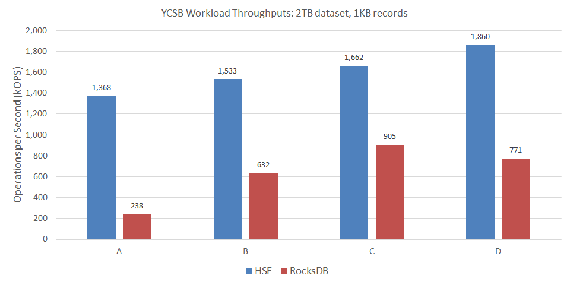
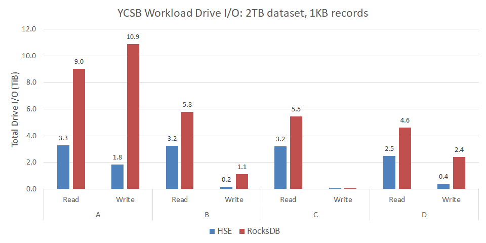

# YCSB

YCSB (Yahoo!&reg; Cloud Serving Benchmark) is an industry-standard
benchmark for databases and storage engines supporting key-value
workloads.  The YCSB implementation is open source, and includes an
extensible framework for integrating different data stores.

We integrated HSE with YCSB to make it easy to compare its performance
and scalability to that of  other storage engines for YCSB workloads.
The `hse-ycsb` [repo](https://github.com/hse-project/hse-ycsb) is a fork of
YCSB that adds support for HSE.

In the sections that follow, the reader is assumed to be familiar with
configuring and running the YCSB
benchmark.  The information provided here is specific to using YCSB with HSE.

## Install HSE and Create a KVDB

Review the getting started section of this documentation.
Then, following those instructions and examples, start by

* Installing HSE and mpool from packages or source
* Configuring an mpool for HSE storage with appropriate permissions
* Creating an HSE KVDB in that mpool to store the YCSB data

In the examples below, we assume the name of the mpool is `ycsbData`,
which is also the name of the KVDB.


## Install YCSB Dependencies

Install dependencies for your platform.

=== "RHEL 8"

    ```
    $ sudo dnf install maven rpm-build
    ```

=== "Ubuntu 18.04"

    ```
    $ sudo apt-get install maven
    ```

=== "RHEL 7"

    ```
    $ sudo yum install rh-maven36 java-1.8.0-openjdk java-1.8.0-openjdk-devel rpm-build
    ```


## Install YCSB with HSE from Packages

YCSB with HSE can be installed from release packages.

Download and install the latest `hse-ycsb`
[package](https://github.com/hse-project/hse-ycsb/releases) for your platform.
Package names start with `hse-ycsb*A.B.C.D.E-X.Y.Z`, where

* `A.B.C` is the YCSB version (e.g., `0.17.0`)
* `D.E` is our YCSB integration version
* `X.Y.Z` is the minimum HSE release version required

!!! tip
    An example of a specific prefix is hse-ycsb-0.17.0.2.1-1.8.0.

Install the package for your platform as follows.

=== "RHEL 8"

    ```
    $ sudo dnf install ./hse-ycsb-A.B.C.D.E-X.Y.Z*.rpm
    ```

=== "Ubuntu 18.04"

    ```
    $ sudo apt-get install ./hse-ycsb_A.B.C.D.E-X.Y.Z*.deb
    ```

=== "RHEL 7"

    ```
    $ sudo yum install ./hse-ycsb-A.B.C.D.E-X.Y.Z*.rpm
    ```


## Install YCSB with HSE from Source

YCSB with HSE can also be built and installed from source.

Clone the latest release tag from the `hse-ycsb`
[repo](https://github.com/hse-project/hse-ycsb/releases).
Releases are named `rA.B.C.D.E-hse-X.Y.Z` where

* `A.B.C` is the YCSB version (e.g., `0.17.0`)
* `D.E` is our YCSB integration version
* `X.Y.Z` is the minimum HSE release version required

!!! tip
    An example of a specific release tag is r0.17.0.2.1-hse-1.8.0.

For example

    $ git clone https://github.com/hse-project/hse-ycsb.git
    $ cd hse-ycsb
    $ git checkout rA.B.C.D.E-hse-X.Y.Z

Build and install YCSB for your platform as follows.

=== "RHEL 8"

    ```
    $ make package
    ```
    
    !!! note
        For `r0.17.0.2.0-hse-1.7.1` instead use `make rpm`

    Install the resulting package as described above for the RHEL 8 release
    package.  You can locate the package built by executing
    ```
    $ find /tmp/$(id -un)/ -name hse-ycsb*.rpm
    ```

=== "Ubuntu 18.04"

    ```
    $ make package
    ```
    Install the resulting package as described above for the Ubuntu 18.04 release
    package.  You can locate the package built by executing
    ```
    $ find /tmp/$(id -un)/ -name hse-ycsb*.deb
    ```

=== "RHEL 7"

    ```
    $ scl enable rh-maven36 "make rpm"
    ```
    Install the resulting package as described above for the RHEL 7 release
    package.  You can locate the package built by executing
    ```
    $ find /tmp/$(id -un)/ -name hse-ycsb*.rpm
    ```


## New YCSB Options

The build of YCSB with HSE adds the following options.

* `hse.mpool_name` is the name of the mpool (KVDB) storing the YCSB data
* `hse.params` is a string of comma-separated HSE parameters; e.g.,
`"kvdb.dur_intvl_ms=1000,kvdb.log_lvl=6"`
* `hse.config_path` is the path to an HSE configuration file

HSE also installs configuration files
in `/opt/hse/config` for use with YCSB.
There are separate configuration files for each of load and run phases.
Furthermore, YCSB Workload E has its own pair of HSE configuration files.

## Run YCSB with HSE

The following executes YCSB Workload A with HSE

    $ cd /opt/hse-ycsb/
    $ sudo alternatives --set python /usr/bin/python2
    $ ./bin/ycsb load hse -threads 96 -P workloads/workloada -p recordcount=200000 -p hse.mpool_name=ycsbData -p hse.config_path=/opt/hse/config/native_ycsb_abcdf_load.yml
    $ ./bin/ycsb run hse -threads 96 -P workloads/workloada -p recordcount=200000 -p operationcount=200000 -p hse.mpool_name=ycsbData -p hse.config_path=/opt/hse/config/native_ycsb_abcdf_run.yml

The owner (UID) and group owner (GID) of the mpool that `ycsb` will use
to store data should match the user account running `ycsb`.

See the [release notes](../help/relnotes.md#ycsb-release-notes) for any
limitations or known issues for a particular release of YCSB with HSE.


## YCSB Performance Results

Below are results from running YCSB with HSE.
For comparison, we include results from running YCSB with
[RocksDB](https://rocksdb.org/), a popular and widely-deployed key-value
store.

Server configuration:

* 2-socket Intel&reg; Xeon&reg; CPU E5-2690 v4
* 256GB DRAM
* 4x Micron&reg; 9300 NVMe SSDs 3.2TB in an LVM striped logical volume
* RHEL 8.1
* HSE 1.7.0
* RocksDB 6.6.4

YCSB benchmark configuration:

* 2TB dataset consisting of 2-billion 1,000-byte records
* 96 client threads
* 2 billion operations per workload
* YCSB 0.17.0

For HSE, we specified the configuration files
`/opt/hse/config/native_ycsb_abcdf_load.yml` and
`/opt/hse/config/native_ycsb_abcdf_run.yml` for the load and run phases
of YCSB, respectively.  These are installed with HSE.

The following table summarizes the YCSB workloads presented here.
The application examples come from the YCSB documentation.

| YCSB Workload | Operations | Application Example |
| :-- | :-- | :-- |
| A | 50% Read; 50% Update | Session store recording user-session activity |
| B | 95% Read; 5% Update | Photo tagging |
| C | 100% Read | User profile cache |
| D | 95% Read; 5% Insert | User status updates |


### Load Phase

YCSB starts by populating the dataset (database) to the size specified.
This is a 100% Insert workload.  Load phase statistics are presented
in the following table.
For this workload, HSE delivered more than 8x the throughput
compared to RocksDB &mdash; reducing total duration by 88%.

| Load Metric | HSE | RocksDB |
| :-- | --: | --: |
| Duration (minutes) | 34 | 271 |
| Inserts / second | 986,009 | 122,899 |
| Insert 99.9% latency (ms) | 1.6 | 19.5 |


### Run Phase

Run phase throughputs for HSE and RocksDB are shown in the following chart.
For these YCSB workloads, HSE delivered up to nearly 6x more throughput
than RocksDB.



In delivering high throughput, HSE also demonstrated good 99.9% tail latency,
as shown below.
For these YCSB workloads, HSE reduced read tail latency up to 42%, and
write (insert or update) tail latency by as much as 91%.


Finally, we measured the amount of data written to and read from
the drives in the course of executing each workload.  Reducing writes
is important for SSDs because it translates to increased
endurance.  Reducing both writes and reads is important for
networked storage to reduce load on the fabric.

The following chart shows the total bytes of data written to or
read from the drives during workload execution.
For these YCSB workloads, HSE reduced bytes read up to 64%, and
bytes written by as much as 85%.


