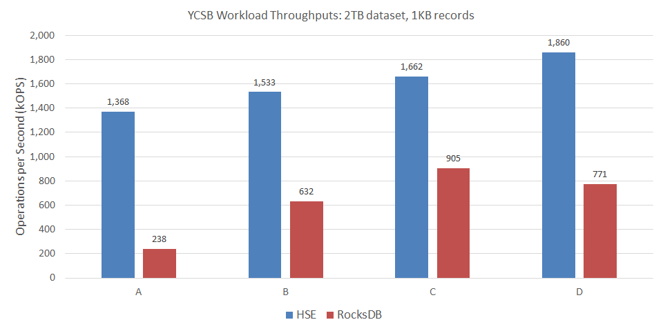

---
hide:
  - navigation
  - toc
---

# Heterogeneous-Memory Storage Engine

**HSE** is a fast embeddable key-value store designed for SSDs and persistent
memory.  HSE optimizes performance and endurance by orchestrating data
placement across DRAM and multiple classes of solid-state storage devices.

HSE is ideal for powering Databases, Software-Defined Storage (SDS),
High-Performance Computing (HPC),
Internet of Things (IoT), and Machine Learning (ML).

## Key Features

* Rich set of key-value operations
* Full transactions with snapshot-isolation spanning multiple
independent key-value collections
* Cursors for iterating over snapshot views
* Data model for optimizing mixed use-case workloads in a single data store
* Key and value compression
* Flexible durability controls
* Configurable data orchestration schemes
* Native C library that can be embedded in any application

## Benefits

* Scales to terabytes of data and hundreds of billions of keys per store
* Efficiently handles thousands of concurrent operations
* Dramatically improves throughput, latency, write-amplification,
and read-amplification versus common alternatives for many workloads
* Optionally combines multiple classes of solid-state storage to
optimize performance and endurance

## Performance

HSE delivers up to **6x** the throughput of [RocksDB](https://rocksdb.org)
on the industry standard [YCSB](https://github.com/brianfrankcooper/YCSB)
benchmark.
HSE achieves this higher throughput with lower latency, write-amp, and
read-amp as detailed [here](./apps/ycsb.md).

HSE integrated with [MongoDB&reg;](https://github.com/mongodb/mongo)
delivers up to **8x** the YCSB throughput of the default WiredTiger
storage engine.
Here again, HSE achieves this higher throughput with lower latency, write-amp,
and read-amp as detailed [here](./apps/mongodb.md).

